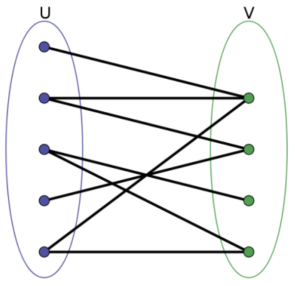

# 二分图(Bipartite Graph)

二分图又称作二部图，是图论中的一种特殊模型。 设 $G=(V,E)$ 是一个无向图，如果顶点 $V$ 可分割为两个互不相交的子集 $(A,B)$，并且图中的每条边 $(i,j)$ 所关联的两个顶点 $i$ 和 $j$ 分别属于这两个不同的顶点集 $(i \in A,j \in B)$，则称图 $G$ 为一个二分图。

如下图，是一个二分图，因为点可以被分成两个点集，且每个集合内的点之间互不相邻（互相之间没有边连接）

在很多情况下，二分图并不像上图一样显而易见，因此需要设计算法来区分一个图是不是二分图。

一个简单的方法是染色法，即从其中一个顶点开始，将跟它邻接的点染成与其不同的颜色，**如果邻接的点有相同颜色的，则说明不是二分图**。每次用bfs遍历染色即可。

# Reference

 - https://zh.wikipedia.org/wiki/%E4%BA%8C%E5%88%86%E5%9B%BE
 - https://blog.csdn.net/zhangxian___/article/details/73699241