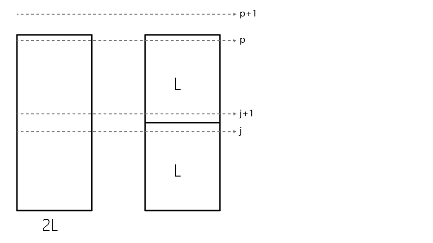

# 存储最多程序问题

---
**实例：** $n$ 个程序，其存储所需容量分别为 $L_{1}, L_{2}, \cdots, L_{n}$ 。两个磁盘，其容量都 为
$L$。

**询问：** 若不允许一个程序同时存放于两个磁盘内，则这两个磁盘最多能存储多少个程序?

---

该问题是一个 NP-hard 问题，可以通过 [划分问题](../doc/par.html) 图灵归约证明

## NP-hard 证明

假设存在一个求解该问题的算法 $P(L_1,...,L_n;L)$，对于一般划分问题实例 $A, S(a)$，输入 $P(a_1,...,a_n;S(A)/2)$，如果有解，则划分问题输出 YES，否则划分问题输出 NO，得证。

## 近似算法性能比证明

---
**算法：求解存储最多程序问题**

1. 对 $n$ 个程序, 按其存储所需容理的非降顺序编号, 即 $L_{1} \leqslant L_{2} \leqslant \cdots \leqslant L_{n}$。
2. 按程序编号从 1 到 $n$ 依次向磁盘 1 存放程序，磁盘 1 放不下时， 转向磁盘 2 存放程序。
3. 依次按照程序顺序向磁盘 2 存放程序，到磁盘 2 放不下为止。
4. 输出两个磁盘上的程序数。

---

即算法 $A$ 为多项式时间绝对近似算法。 

首先考虑一个假想的单磁盘，其容量为 $2 L$，如果它能按照从小到大的顺序存储 $p$ 个程序，那么易得 $OPT(I)\leq p$。

其次，注意到使用该算法在两个容量为 $L$ 的磁盘中装软件时，能够装的软件数量 $A(I)\leq p$，此时确认了算法能装的软件数量的上界，下面来确认下界。

假设按照算法 A ，在磁盘 1 中可以存放 j 个程序，那么第 $j+1$个程序，在 $2L$ 的磁盘中的装法和在两个$L$的磁盘中的装法可能不同，如下图所示：

如果第 j 个程序恰好填满了磁盘 1，或者空出来的空间多于$2L$磁盘装法最后剩下来的空间。那么算法 $A$ 的解和在 $2L$ 的单磁盘中的解的情况相同，此时磁盘 2 中则能够装 下 $p-j$ 个程序。

否则，因为程序大小按序号排列，所以磁盘 2 中一定会少装一个程序（且最多少装一个程序）。

因此确认了算法 A 解的下界，即 $p-1 \leq A(I)$。

又因为 $OPT(I)\leq p$，所以 $OPT(I) \leq p \leq A(I)+1$，即

$$|OPT(I)-A(I)|\leq 1$$

