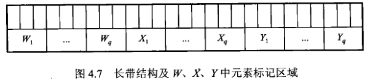

# 划分问题

划分问题表述为：

**实例：** 有限集合 $A$ ，对应于每个 $a \in A$，有正整数价值 $S(a) \in Z^{+}$。

**询问：** 是否存在子集 $A^{\prime} \subseteq A$，使得 

$$\sum_{a \in A^{\prime}} S(a)=\sum_{a \in A-A^{\prime}} S(a)$$

> 划分问题可以看成的将一堆价值不等的物体分成两堆价值相等的，每一堆的价值是总价值的一半

## 核心思路

要将 3DM 问题多项式变换 PAR 问题的核心思想如下：

1. 将 $W,X,Y$ 中的每一个元素依次按顺序定义为一个只有一位为 1，其余位皆为 0 ，且不可能通过**有限次进位**互相得到的二进制值（目的是为了让其他元素没有办法通过累加得到其他元素的值，也即让这些元素**唯一**）。
2. 将 $M$ 中的每一个元素 $m_i$ 都作为 PAR 问题中集合 $A$ 的元素 $a_i$，此时元素 $a_i$ 的价值 $S(a_i)$ 可以通过将 $m_i$ 中的三个元素分配的二进制值加起来得到。

3. 当完美对集 $M'$ 存在时，将 $M'$ 中的所有元素相加，就可以以此得到一个唯一的由 $M'$ 确定的二进制串，其值确定，表示为 $B$。此时将 $M$ 中的所有元素相加，也可以以此得到一个二进制串，值为 $S(M)$，即

$$
S(M) = \sum_{i=1}^{K} S\left(a_{i}\right)
$$
    
4. 此时，在 $A$ 中额外构建两个辅助元素 $b_1$ 和 $b_2$（也即 A 集合的总大小为 $|M| + 2$）

$$S\left(b_{1}\right)=2 \sum_{i=1}^{K} S\left(a_{i}\right)-B, \quad S\left(b_{2}\right)=\sum_{i=1}^{K} S\left(a_{i}\right)+B$$

 - 其总价值易得为 4 倍的 $S(M)$，即

$$
4 \sum_{i=1}^{K} S\left(a_{i}\right)
$$
    
 - 因此，如果存在完美划分，那么 $b_1$ 和 $b_2$ 肯定在不同的划分中，且每个划分的总价值均为 2 倍的 $S(M)$

5. 最后，通过方法不等式和推导可以证明，仅完美对集 $M'$ 存在时候， 可以找出一个 $B$ 和 $b_1$ 一起， $M-M'$ 和 $b_2$ 一起。

## NPC 证明

首先构建一个 $3 DM$ 问题实例, 即

**实例：** 集合 $M \subseteq W \times X \times Y,$ 其中 $W 、 X 、 Y$ 是互不相交的集合, $\quad$ 且 $|W|=|X|=|Y|=q$ 。 其中, $W=\left\{w 1, w 2_{,} \ldots, wq\right\}, X=\{x 1, \ldots, xq\}, Y=\{y 1, \ldots, yq\},$ 且 $M=\{m 1, \ldots, mk\}$

定义 $p$
$$
p=\left\lceil\log _{2}(K+1)\right\rceil
$$
	
随后, 为 $W_{1} X, Y$ 中的每个元素分配一个二进制值。将 $W, X, Y$ 中元索按顺序重新排列 为 $w_{1}, w_{2}, \ldots, w_{q}, x_{q+1}, x_{q+2}, \ldots, x_{2 q}, y_{2 q+1}, \ldots, y_{3 q},$ 定义函数 $V()$ 表示每一元素的值, 则
$V(w 1) \ldots V(y 3 q)$ 依次为 $2^{p(3 q-1)}, 2^{p(3 q-2)}, \ldots, 2^{p(2 q)}, \ldots, 2^{1}, 2^{0},$ 共 $3 q$ 个元素。

<!-- \\mathrm\{([^}]+)\} -->

其值可以看做是下图每一元素的最右边的第一个格子。

	
此时, 定义 PAR 的实例 $A=\{a_1, a_2, \ldots, a_k, b_1,b_2\}$， 定义 $S(a_i)$ 的值为相应 $m_i$ 中的三个分
量对应的二进制值之和。令 $m_{i}=\left\{w_{f(i)}, x_{g(i)}, y_{h(i)}\right\}, f, g, h$ 分别表示 $mi$ 元素中三个分量在其对应集合中的下标, 则 

$$S(ai)=V(w)+V(x)+V(h)$$

此时, 易得 $|M|=K \leq 2^{p}-1,$ 而 $\frac{V\left(w_{i}\right)}{V\left(w_{i+1}\right)}=\frac{2^{p(3 q-i)}}{2^{p(3 q-i+1)}}=2^{p},$ 因此 $KV(wi)<V(wi+1)_{\circ}$ 由
于 $K$ 是 $M$ 的数量, 也即每个 $V(w), V(x), V(y)$ 在该集合内, 不可能由其他的 $V(w) \ldots$ 累加
得到。
设 $B$ 为 $W, X, Y$ 中所有元素一进制值之和, 表示为:
$$
B=\sum_{j=0}^{3 q-1} 2^{p j}
$$

由以上结论可得，只有完美对集中所有元素的二进制值之和为 $B$，此时，任意子集 $A*$ （不是完美划分）的元素价值之和为 $B$，当且仅当 $M'$ 为 $M$ 的完美对集，其中 
	
$$
\begin{array}{l}
A^{*} \subseteq\left\{a_{i} \mid 1 \leqslant i \leqslant K\right\} \\
M^{\prime}=\left\{m_{i} \mid a_{i} \in A^{*}\right\}
\end{array}
$$
	
现在定义 $A$ 中剩余的两个元素 $b_1,b_2$ 的值分别为：

$$
S\left(b_{1}\right)=2 \sum_{i=1}^{K} S\left(a_{i}\right)-B, \quad S\left(b_{2}\right)=\sum_{i=1}^{K} S\left(a_{i}\right)+B
$$
	

此时，得 A 中所有元素长度之和为
	
$$
S(A)=\sum_{i=1}^{K} S\left(a_{i}\right)+S\left(b_{1}\right)+S\left(b_{2}\right)=4 \sum_{i=1}^{K} S\left(a_{i}\right)
$$

在极限情况下, $\quad w_{1}=2^{p(3 q-1)},$ 且 $M$ 中所有元素均存在 $w 1,$ 此时 $K 2^{p(3 q-1)}<$
$2^{q} 2^{p(3 q-1)}=2^{3 p q},$ 因此 $S(M)<2^{3 p q+1}, \quad ~S(~b 2)<2 ~S(M), S(b 1)<2 ~S(M),$ 而 $2 S(M)<$
$2^{3 p q+2},$ 因此两个数, 以及其他的数均可用不多于 $3 pq+1$ 位的二进制数表示, 这说明 这项变换是多项式时间的。

(->) 假设集合 $A$ 中存在子集 $A^{\prime},$ 使
$$
\sum_{a \in A^{\prime}} S(a)=\sum_{a \in A-A^{\prime}} S(a)=2 \sum_{i=1}^{K} S\left(a_{i}\right)
$$
成立。那么在子集 $A$ 或 $A-A$ '中必有一个含有元索 $b_{1}$ 但不含有元素 $b_{2}$。 不妨假设 $A'$ 中含有元素 $b_{1}$ 而不含有元素 $b_{2},$ 那么 $A^{\prime} \cap\left\{a_{i} \mid 1 \leqslant i \leqslant K\right\}$ 中元索长度之和应该等于 $B,$ 根据
上面讨论, $A^{\prime} \cap\left\{a_{i} \mid 1 \leqslant i \leqslant K\right\}$ 中的元素所对应的 $M$ 中的子集 $M^{\prime}$ 是一个完美对集。

(<-) 若在 3DM 问题的这个实例中， $M^{\prime} \subseteq M$ 是 $M$ 的完美对集，则在 $PAR$ 问题相应实例中， 设 $A^{\prime}=\left\{a_{i} \mid m_{i} \in M^{\prime}\right\} \cup\left\{b_{1}\right\},$ 则 $S\left(A^{\prime}\right)=\sum_{m_{i} \in M^{\prime}} S\left(a_{i}\right)+S\left(b_{1}\right)=B+2 \sum_{i=1}^{K} S\left(a_{i}\right)$
$-B=2 \sum_{i=1}^{K} S\left(a_{i}\right)$。 于是我们证明了 $3 DM \propto PAR, \quad$ 即 $PAR \in NPC 。$
