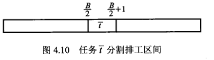

# 区间排工（sequencing within intervals）问题

区间排工问题说的是，现在有多个任务 $t$ ，每一个任务存在最早起始时间 $r(t)$ 和最晚截止时间$d(t)$，每一个任务都需要消耗一定量的时间$L(t)$，那么有没有可能把所有的任务都按时完成？

该问题的形式化表示如下：

**实例：** 有限任务集合 $T,$ 对每个任务 $t \in T$ 有最早加工起始时间 $r(t),$ 加工最后期限 $d(t)$ 以及加工长度 $L(t),$ 其中 $r(t), d(t), L(t) \in Z^{+}, \quad r(t) \geqslant 0$

**询问：** 是否存在对 $T$ 的可行排工表。即是否存在映射 $\sigma: T \rightarrow Z^{+},$ 使每个任务 $t \in T,$ 有 $\sigma(t) \geqslant r(t), \quad \sigma(t)+L(t) \leqslant d(t)$。 并且对于任意两个任务 $t, t^{\prime}, \quad$ 总有 $\sigma\left(t^{\prime}\right)+L\left(t^{\prime}\right) \leqslant \sigma(t)$ 或
$\sigma(t)+L(t) \leqslant \sigma\left(t^{\prime}\right)$

该问题求解的条件是：任务 $t$ 在时间区间 $[\sigma(t), \sigma(t)+L(t)]$ 内被加工; 加工开始时刻 $\sigma(t)$ 应在 $r(t)$ 之后，即 $\sigma(t) \geqslant r(t),$ 且需在 $d(t)$ 时刻之前完成， 即 $\sigma(t)+L(t) \leqslant d(t) ;$ 在加工任 务 $t$ 期间，不能再接受其他任何加工任务， 即 $\sigma\left(t^{\prime}\right)+L\left(t^{\prime}\right) \leqslant \sigma(t)$ 或 $\sigma(t)+L(t) \leqslant \sigma\left(t^{\prime}\right)$ 。

该问题的求解可以通过将 [划分问题](par.html) 归约到该问题证明。

## NPC 证明

根据划分问题实例 $A=\{a_1,a_2,...,a_n\}$，令$B=\sum_{a\in A}S(a)$，以此构建区间排工问题实例。

将每一个划分问题实例中的元素都转换为区间排工问题中的一个任务，且最早开始时间 $r(t)$ 均为0，最晚结束时间 $d(t)$ 均为 $B+1$，任务长度$L(t)=S(a)$

之后，再额外构建一个新元素 $\bar{t}$，要求 $r(\bar{t})=\left[\frac{B}{2}\right\rceil, d(\bar{t})=\left[\frac{B+1}{2}\right\rceil$ 及 $L(\bar{t})=1$

该变换**显然可在多项式时间**内完成。

首先排除 B 为奇数（此时不可能存在划分问题的解）的情况，此时最后一个任务 $r(\bar{t})=d(\bar{t})=\left\lceil\frac{B+1}{2}\right\rceil$，因此没有办法安排任务，也即排工问题也不存在解，成立。

当 B 为偶数时，$r(\bar{t})=\frac{B}{2}, d(\bar{t})=\left\lceil\frac{B+1}{2}\right\rceil=r(\bar{t})+1$，可以发现最后一个任务将排工时间必须安排在时间轴的正中间，从而将排工时间轴$[0,B+1]$等价的分为两半，如下图所示：

因此可简单做如下证明：

当划分问题有解 $A'$，当且仅当对应排工问题实例可以将任务分为两组，分别安排在区间 $[0,\frac{B}{2}]$ 和 $[\frac{B}{2}+1,B+1]$ 中。

得证。