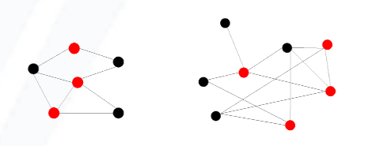
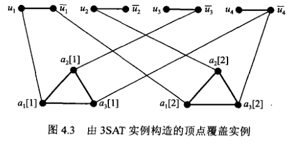

# 图的顶点覆盖问题（VC）

顶点覆盖是在一个图中找一些点集，这些点集能够**覆盖**所有的边。

> 最小顶点覆盖则要求点的数量是最小的。

如下图，图中的两个图红色的点分别构成了这两个图的一个（最小）顶点覆盖，

顶点覆盖问题要求在一张图上找出不多于 K 个点的点集形成该图的一个顶点覆盖。其形式化定义为：

**实例：** 无向简单图 $G=(V, E),$ 一个非负整数 $K \leqslant \mid V_{\circ}$ 

**询问：** 图 $G$ 是否存在顶点覆盖 $V^{\prime} \subseteq V$ 且 $\mid V' \leqslant K_{\circ}$ 所谓顶点覆盖 $V^{\prime}$ 是指 $G$ 中任意边 $(u, v) \in E$ 至少有一个顶点属于 $V^{\prime}, \quad$ 即 $\{u, v\} \cap V^{\prime} \neq \varnothing_{\circ}$

该问题通过将 [3SAT](3sat.html) 归约到 VC 来完成。

## 核心思路

以 3SAT 实例 $U=\left\{u_{1}, u_{2}, u_{3}, u_{4}\right\}$ 及 $C=\left\{\left\{u_{1}, \bar{u}_{3}, \bar{u}_{4}\right\},\left\{\bar{u}_{1}, u_{2}, \bar{u}_{4}\right\}\right\}$ 为例，构建出的顶点覆盖实例如下所示：

该实例由三部分组成：每一个布尔变量的正反项生成两个顶点和一条边（表示为一条直线（命名为线集），每一个项生成三个顶点和三条边（表示为一个三角形）（命名为三角形集）。最后，每个线图和每个三角形图之间通过项的组成再次连接直线（命名为边集）。

(->）当 3SAT 实例存在真值指派时，如果 $u_i=T$那么在顶点覆盖中就选择 $u_i$，否则就选择 $\bar{u_i}$，这种方式保证了所有的线集都被覆盖，且每个三角形对应的三条边中至少有一条边也被覆盖，因此在三角形集中选择和还未覆盖的两条边相连的两个点即可完成顶点覆盖。

(<-) 当实例存在顶点覆盖集 $V'$ 时，可得 $V'$ 一定会包含每个线图的一个顶点，以及每个三角形的两个顶点（反证法，如果每个线图都没有顶点的话，那么没有其他的点可以用于覆盖两点之间的线，三角形同理）。

因此还剩下最后边集的覆盖。由于每一个三角形上的两个顶点都能覆盖边集上的两条，因此还需要来自于顶部线图中的点覆盖第三条边，这样就形成了一个对应关系：**每一个三角形实际上对应的是3SAT中的一个项，选择一个点来覆盖第三条对应着让相应的布尔变量指派为真**。因此，让顶点覆盖中来自于线图的点对应的布尔变量的指派为真，即可得到解决 3SAT 问题的真值指派。

