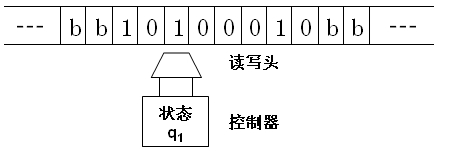

# 图灵机

直观地看，图灵机是由一条两端可无限延长的带子、一个读写头以及一组控制读写头工作的命令组成，如下图：

读写头可以沿带子方向左右移动，并可以在每个方格上进行读写。其中带子上所有可能的字符构成输入集合，机器能够写到带子上的所有可能的字符构成输出集合；此外，机器自身还有一系列状态（最简单的，如启动、关闭两个状态）；最后，机器通过输入来控制向左还是向右移动一格（或是不动），以及通过输入来控制机器的输出（更改带子上的内容）和下一个时刻所处的状态。

换句话表示，图灵机可以被看成是一个函数：根据输入和函数的定义来得到输出。

其中，输入是当前纸带的内容和机器的状态；输出是机器的下一个状态、下一个位置（向左、向右、不移动）和纸带方格的输出。机器内部存在一个状态转移函数来定义这一从输入到输出的映射。

这里的函数是普通函数的概念，请不要将其概念神话：函数的实质是一个多对一的映射。只不过在这里，输入是二维的值，输出是三维的纸，且和平常的数字脱离了。

## 停机

考虑图灵机在什么情况下停机。一般编写程序，其退出的原因有两个：执行成功、产生错误。这同样适用于图灵机。当图灵机启动时，通过输入不断的更改自己的下一个状态，永不停歇，直到状态切换到了停机状态。

一般而言，分别为“执行成功”、“产生错误”两个概念定义停机的状态集，一般分别称其为**接受状态集**和**拒绝状态集**，他们都是一个图灵机的状态集合的子集，当处于这两个集合之外的状态时，图灵机不会停止运行。

我们可以构造出一组输入集、输出集、状态转移函数来求解特定的问题，当定义求解一类问题的图灵机时，定义问题的实例为 $I$ ，那么 $I$ 就可以以纸带的形式放到图灵机上，随后根据图灵机的一系列状态转移、输出，最终停机。

<!-- 实际上，虽然图灵机已经是一种对求解算法问题的抽象描述了，但实际上完全可以抛开这些概念，把图灵机直接看成是一个函数：根据输入，得到输出。 -->

