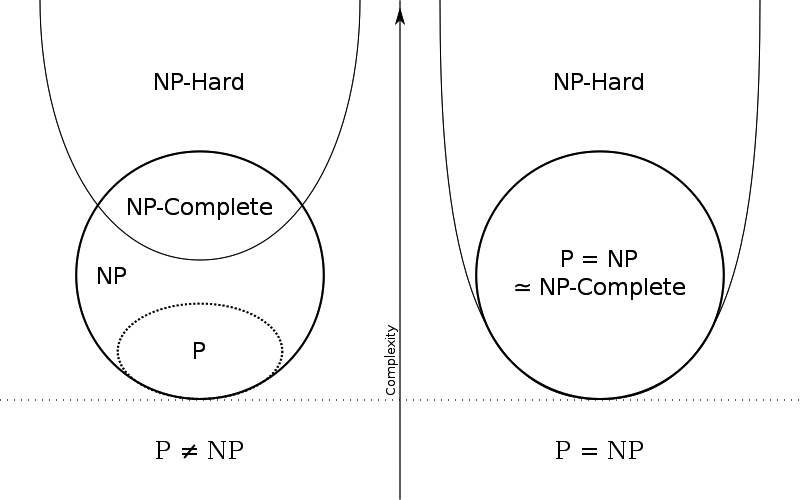

# P(polynominal, 多项式)

即在多项式时间内可解的问题

# NP(Nondeterministic polynominal, 非确定性多项式)

存在一部分问题，没有办法在多项式时间内解决，但能在**多项式时间内验证某一答案是否正确**。

如果有一台[非确定型图灵机](./2.html)，那么一个 NP 问题就可以在穷举所有答案后在多项式时间内被解答出来（理想情况下，所有答案在同一时间被穷举，然后在剩下的多项式时间内被同时验证）。

# NPC(Nondeterminism Polynomial complete, NP完全)
随后就有一个很著名的问题，即 NP类问题等于 P类问题吗？是否所有能在多项式时间内验证得出正确解的问题，都是具有多项式时间算法的问题呢？

一旦解决这一问题，那么所有的 NP 问题都可以通过计算机来解决。

解决这一问题的一个办法，就是[归约法](./5.html)。如果问题B的算法可以用来解决A（不要求 A 的算法能解 B） ，我们就说问题A可以归约成问题B。比如二元一次方程和一元一次方程的求解方法。显然二元一次方程的解法可以用来求解一元一次方程（令二次项系数为0）。

因为归约是具有传递性的，即如果 A 可以归约到 B，B 可以归约到 C，A 就可以归约到C。

那么如果有一个终极的 NP 问题，其他所有的 NP 问题都可以归约到这个问题上，那么当这一个终极 NP 问题解决时，所有的 NP 问题就都解决了。

如果这个终极的问题存在，那么这个终极问题就被称为是 NPC，能归约到该问题上的其他问题被称为NPC类问题。

现在，只剩下一个问题了，就是是否存在 NPC 类问题？

1970年 [Cook](../doc/sat.html) 证明了第一个 NPC 问题。

## 强 NPC 类问题
存在一些 NPC 问题，当问题中的**某个数值参数固定或存在上限时**，该问题可以被一个**多项式时间算法**验证，这类问题在 NPC 问题中相对更加简单，解决的多项式时间算法叫**伪（pseudo）多项式时间算法**。

而在 NPC 类问题中，除去上面描述的存在伪多项式时间算法的 NPC 类问题后，剩下问题就属于强 NPC 类问题。强 NPC 类问题一定不存在伪多项式时间算法。

> 一个例子是[划分问题](../doc/par.html)的动态规划算法，可以参考书中 P124 了解。

# NP 难问题
NP困难（NP-hard）难在**不一定**在多项式时间内**被验证正确性**，即使NP完全问题有多项式时间的解（P=NP），NP困难问题依然可能没有多项式时间的解。因此NP困难问题 “**至少与NP完全问题一样难**” 。

> 因此， NPC 问题也可以看做是 NP-hard，其属于 NP-hard 的子集。

当 $P\not=NP$ 时，NP问题和 NP-hard 的交集就是 NPC 问题；当 $P=NP$ 时，$P=NP=NPC$，如下图所示：

NP-hard 问题由[图灵归约](./5.html)得到，有三种途径：

 - 一个问题能由任意一个NP问题图灵归约到该问题，则该问题是NP-Hard。
 - 一个问题能由某个NPC问题图灵归约到该问题，则该问题为NP-hard。 
 - 若 $\pi_{1}$ 是NP-hard问题， $\pi_{1}$ 可以图灵归约到 $\pi_{2}$（即 $\pi_{1}\propto_t \pi_{2}$）, 则 $\pi_{2}$ 也是NP-hard问题。

# Reference
 - https://zhuanlan.zhihu.com/p/73953567
 - https://zh.wikipedia.org/wiki/NP%E5%9B%B0%E9%9A%BE