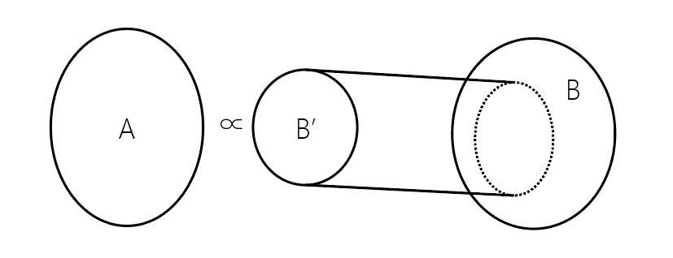

# 多项式归约

多项式归约也叫多项式变换，通常用在对 NPC 问题的证明中，在 [NPC](./4.html) 一节中简单的提到过。

设想两个问题 A 和 B，A 是 NPC 类问题，B 至少是 NP 问题。

如果所有 A 问题的实例 $I_A$ ，都可以在**多项式时间内变换**成一个 B 问题的实例 $I_B$，且能够证明当 $I_A$ 有解时**当且仅当** $I_B$ 有解，那么就说明 **B 问题所有实例中，至少存在一个实例子集和问题 A 在多项式时间内等价**（不完全正确，但也可以理解为，B 问题的难度大于等于 A 问题，当 B 问题有解，那么 A 问题肯定有解）。那么 B 问题自然也是 NPC 类问题。不过，如果 **A 问题是 NP 类问题**而不是 NPC，那么只能说明 **B 是（可能）更难的 NP 问题**，而不能证明 B 是 NPC。

上述的过程即为多项式归约（变换），其形式化表述为：

在 $\mathrm{NP}$ 类判定问题 $\pi_{1}=\left\langle\Sigma_{1}, L_{1}, \Phi_{1}\right\rangle$ 和 $\pi_{2}=\left\langle\Sigma_{2}, L_{2}, \Phi_{2}\right\rangle$ 之问,若存在变换 $f: \Sigma_{1}^{*} \rightarrow$
$\Sigma_{2}^{*}, f\left(L_{1}\right) \subseteq L_{2}, \quad$ 使 $\forall I \in L_{1},$ 恒有 $\Phi_{1}(I)=\Phi_{2}(f(I)),$ 并且可用某个 $\mathrm{DTM}$ 程序在 $|I|=n$ 的多项
式时间内计算出 $f(I),$ 则称判定问题 $\pi_{1}$ 可多项式归约为 $\pi_{2}, f$ 为 $\pi_{1}$ 到 $\pi_{2}$ 的多项式归约, 记为 $\pi_{1} \propto \pi_{2}$。

另外一种表述为：

设 $\pi_{1}=\left\langle\Sigma_{1}, L_{1}, \Phi_{1}\right\rangle$ 和 $\pi_{2}=\left\langle\Sigma_{2}, L_{2}, \Phi_{2}\right\rangle$ 是两个 $\mathrm{NP}$ 类判定问题, 如果映射 $f: L_{1} \rightarrow L_{2}$
满足下述条件: (1) 对任意 $I \in L_{1}, f(I)$ 能用 $|I|$ 的多项式时间确定算法实现 $;(2)$ 若 $I \in Y\left(\pi_{1}\right)$ 当
且仅当 $f(I) \in Y\left(\pi_{2}\right),$ 那么称映射 $f$ 是从 $\pi_{1}$ 到 $\pi_{2}$ 的多项式归约或多项式变换, 记为 $\pi_{1} \propto \pi_{2}$。

--- 

归约的关系可以大致由以下的集合关系表示（其中 $B'\subseteq B$）：

> 当然，也存在一部分问题，可以相互归约，这说明两个问题谁也不比谁难，如[货郎问题](../doc/tsp.html)中的货郎判定问题和货郎优化问题。
> 
> 

## 归约通俗步骤

将问题 A 多项式归约到问题 B，分以下几步：
 - 简单阐述问题 B 是 NP 的。
 - 构造将 A 的任意实例变换到 B 问题实例的方法。
 - 充分必要条件的证明
   - (->) 说明如果问题 A 有解，那么相应的变换后的问题 B 的实例也有解。
   - (<-) 说明如果变换后的问题 B 的实例有解，那么变换前对应的问题 A 的实例也有解

# 图灵归约

图灵归约用于证明一个问题是 [NP-hard](./prob.html)，从而说明某些[搜索问题](./prob.html)的计算复杂性。

其定义基于神谕图灵机，建议参考[神谕图灵机](./3.html)一节的例子理解图灵归约。

理解后，再结合下图

不难理解以下对图灵归约的声明：

 - 一个问题能由任意一个NP问题图灵归约到该问题，则该问题是NP-Hard。
 - 一个问题能由某个NPC问题图灵归约到该问题，则该问题为NP-hard。 
 - 若 $\pi_{1}$ 是NP-hard问题， $\pi_{1}$ 可以图灵归约到 $\pi_{2},$ 则 $\pi_{2}$ 也是NP-hard问题。

## 证明方法

将问题 A 图灵归约到问题 B，分以下几步：

 - 假设存在一个复杂度为 $O(1)$ 的求解问题 B 的算法 $M$ 
 - 利用算法 $M$ 设计一个多项式时间算法解决问题 A。

> 说明问题 B 是 NP 的步骤可以省略，因为 NP-hard 不要求问题是 NP 的。

# 难易度的直观理解

多项式归约实际上也是图灵归约，只不过要求更严。可以直观的将 $\propto$ 符号理解为小于号（开口向右）。

如果问题 $\pi_1 \propto \pi_2$，因为$\pi_1$的所有实例都可以多项式变换为$\pi_2$，那么如果 $\pi_2$ 多项式可解，$\pi_1$一定多项式可解。

但如果$\pi_1$有了多项式可解的算法，那么只能够解$\pi_2$问题的所有实例的一个子集，不能够保证所有实例均多项式可解。

从这一点出发，归约符号右侧的问题，求解难度至少要大于左侧的。
